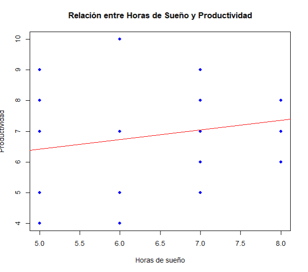
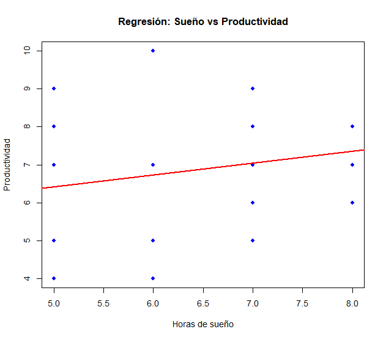

# Análisis de Sueño, Hábitos y Productividad en Jóvenes

## Descripción

Este proyecto tiene como objetivo analizar la relación entre los hábitos de sueño y la productividad en jóvenes, considerando factores como las horas de sueño, el uso del celular antes de dormir, los despertares nocturnos, el nivel de descanso percibido, el consumo de cafeína, las horas de trabajo y la edad.

---

## Encuesta

El formulario utilizado para la recolección de datos se puede consultar en el siguiente enlace:

[Ver encuesta](https://docs.google.com/forms/d/e/1FAIpQLSfj08kTJfbpk-jcBUnYkFwJ3y6qSrjQ58ivA6VouR9Sv55BvA/viewform?usp=header)

---

## Base de datos

Los datos fueron obtenidos a través de una encuesta aplicada a jóvenes. El conjunto de datos incluye variables como nivel de productividad, horas de sueño, uso del celular, despertares nocturnos, descanso percibido, consumo de cafeína, horas de trabajo y edad.

[Descargar base de datos](https://github.com/ilssemares/My-Data-Bases-/blob/main/encuesta_sue%C3%B1o.csv.xlsx)

---

## Metodología

Se diseñó y aplicó una encuesta con preguntas en formato cuantitativo, lo que permitió realizar un análisis estadístico utilizando el software R.

Se realizaron los siguientes pasos:

* Limpieza y renombramiento de variables
* Conversión de datos a formato numérico
* Transformación de la variable **cafeína** a formato binario (Sí = 1, No = 0)
* Análisis de correlación
* Estimación de un modelo de regresión lineal múltiple

---

## Matriz de correlación

La matriz de correlación permite identificar la relación entre las variables del estudio.

Se encontraron:

* Relación positiva débil entre horas de sueño y productividad
* Relación positiva débil entre uso del celular y productividad
* Relación negativa moderada entre descanso y productividad

Esto sugiere que el descanso podría tener un papel importante en la explicación de la productividad.

 productividad horas_sueno uso_celular despertares   descanso horas_trabajo        edad
productividad    1.00000000  0.22374576   0.2439507 -0.07068230 -0.4347874    0.08741377 -0.03470262
horas_sueno      0.22374576  1.00000000   0.4306005 -0.05478021  0.2332422   -0.05163258  0.01846828
uso_celular      0.24395073  0.43060052   1.0000000 -0.10906262  0.1103792    0.17934492  0.37046124
despertares     -0.07068230 -0.05478021  -0.1090626  1.00000000  0.1138424   -0.08421950 -0.17749467
descanso        -0.43478744  0.23324218   0.1103792  0.11384241  1.0000000   -0.21141508  0.06003050
horas_trabajo    0.08741377 -0.05163258   0.1793449 -0.08421950 -0.2114151    1.00000000 -0.01221042
edad            -0.03470262  0.01846828   0.3704612 -0.17749467  0.0600305   -0.01221042  1.00000000

---

## Gráfica de dispersión

La gráfica muestra la relación entre las horas de sueño y la productividad, evidenciando una tendencia positiva débil.

  

---

## Regresión lineal

Se estimó un modelo de regresión lineal múltiple para analizar la relación entre los hábitos de sueño y la productividad.

  

### Resultados del modelo

* R² = 0.3396
* R² ajustado = 0.1674
* El modelo no resultó estadísticamente significativo (p = 0.1117)

---

### Variables significativas

* **Descanso**: presenta un efecto significativo sobre la productividad (p < 0.01)

---

### Interpretación

El análisis muestra que el nivel de descanso es el factor más relevante dentro del modelo.

Sin embargo, la relación negativa observada sugiere que la variable podría estar invertida o interpretarse con cautela.

Las demás variables, como las horas de sueño, el uso del celular, los despertares nocturnos, las horas de trabajo y la edad, no mostraron efectos estadísticamente significativos.

---

### Nota metodológica

La variable de consumo de cafeína no pudo ser estimada en el modelo (NA), lo que sugiere falta de variabilidad o problemas de colinealidad.

---

## Código en R

El código completo utilizado para el análisis se encuentra disponible en el repositorio.

(https://github.com/ilssemares/My-Data-Bases-/blob/main/C%C3%B3digo%20de%20Encuesta)

---

## Conclusión

Los resultados sugieren que, aunque el descanso parece influir en la productividad, el modelo en su conjunto no es suficientemente robusto para explicar de manera significativa el fenómeno.

El análisis permitió aplicar herramientas estadísticas como la regresión lineal y la matriz de correlación, fortaleciendo la comprensión de cómo los hábitos cotidianos influyen en el desempeño.

Se recomienda ampliar la muestra y mejorar la medición de las variables para obtener resultados más concluyentes.

